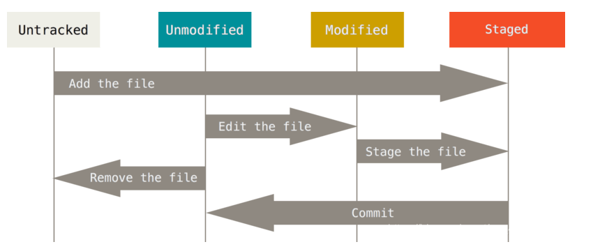

# git 常规命令


### 客户端安装

```
#### ubuntu

sudo apt-get install git
```


### 配置

Git 的 config 文件大致分三类级：仓库级配置文件、用户级配置文件、系统级配置文件

配置文件的权重
<B> 仓库 > 用户 > 系统  </B> 

- 仓库级配置文件：在所创建仓库下 ./.git/config 针对该仓库。 在进入仓库的情况下，
你可以传递 --local 选项让 Git 强制读写此文件，默认情况下用的就是它。

- 用户级配置文件：~/.gitconfig 或 ~/.config/git/config 文件，
你可以传递 --global 选项让 Git 读写此文件，这会对你系统上 所有 的仓库生效。

- 系统级配置文件：在 Git 应用安装目录下 /etc/gitconfig 文件，包含系统上每一个用户及他们仓库的通用配置。
如果在执行 git config 时带上 --system 选项，那么它就会读写该文件中的配置变量。 （由于它是系统配置文件，因此你需要管理员或超级用户权限来修改它。）

```
语法: git config [<options>]        
        
文件位置        
    --global                  #use global config file 使用全局配置文件
    --system                  #use system config file 使用系统配置文件
    --local                   #use repository config file    使用存储库配置文件
    -f, --file <file>         #use given config file    使用给定的配置文件
    --blob <blob-id>          #read config from given blob object    从给定的对象中读取配置
        
动作        
    --get                     #get value: name [value-regex]    获得值：[值]名[正则表达式]
    --get-all                 #get all values: key [value-regex]    获得所有值：[值]名[正则表达式]
    --get-regexp          #get values for regexp: name-regex [value-regex]    得到的值根据正则
    --get-urlmatch            #get value specific for the URL: section[.var] URL    为URL获取特定的值
    --replace-all             #replace all matching variables: name value [value_regex]    替换所有匹配的变量：名称值[ value_regex ]
    --add                     #add a new variable: name value    添加一个新变量：name值
    --unset                   #remove a variable: name [value-regex]    删除一个变量名[值]：正则表达式
    --unset-all               #remove all matches: name [value-regex]    删除所有匹配的正则表达式：名称[值]
    --rename-section          #rename section: old-name new-name    重命名部分：旧名称 新名称
    --remove-section          #remove a section: name    删除部分：名称
    -l, --list                #list all    列出所有
    -e, --edit            #open an editor    打开一个编辑器
    --get-color               #find the color configured: slot [default]    找到配置的颜色：插槽[默认]
    --get-colorbool           #find the color setting: slot [stdout-is-tty]    发现颜色设置：槽[ stdout是TTY ]
        
类型        
    --bool                    #value is "true" or "false"    值是“真”或“假”。
    --int                     #value is decimal number    值是十进制数。
    --bool-or-int             #value is --bool or --int    值--布尔或int
    --path                    #value is a path (file or directory name)    值是路径（文件或目录名）
        
其它        
    -z, --null                #terminate values with NUL byte    终止值与null字节
    --name-only               #show variable names only    只显示变量名
    --includes                #respect include directives on lookup    尊重包括查找指令
    --show-origin             #show origin of config (file, standard input, blob, command line)    显示配置（文件、标准输入、数据块、命令行）的来源
```


#### 配置用户信息
```
$ git config --global user.name "Your Name"

$ git config --global user.email "email@example.com"
```
#### 配置查看 
```
$ git config --list
```

#### 配置配置项
```
# 编辑配置文件
# --local：仓库级，--global：全局级，--system：系统级
$ git config <--local | --global | --system> -e

# 添加配置项
# --local：仓库级，--global：全局级，--system：系统级
$ git config <--local | --global | --system> --add <name> <value>

# 获取配置项
$ git config <--local | --global | --system> --get <name>

# 删除配置项
$ git config <--local | --global | --system> --unset <name>

```

### 工作流程


### 状态



- Untracked: 未跟踪, 此文件在文件夹中, 但并没有加入到git库, 不参与版本控制. 通过git add 状态变为Staged.
- Unmodify: 文件已经入库, 未修改, 即版本库中的文件快照内容与文件夹中完全一致. 这种类型的文件有两种去处, 如果它被修改, 而变为Modified. 如果使用git rm移出版本库, 则成为Untracked文件
- Modified: 文件已修改, 仅仅是修改, 并没有进行其他的操作. 这个文件也有两个去处, 通过git add可进入暂存staged状态, 使用git checkout 则丢弃修改过, 返回到unmodify状态, 这个git checkout即从库中取出文件, 覆盖当前修改
- Staged: 暂存状态. 执行git commit则将修改同步到库中, 这时库中的文件和本地文件又变为一致, 文件为Unmodify状态. 执行git reset HEAD filename取消暂存, 文件状态为Modified

### 创建本地仓库
```
#### 在目录中执行，生成.git文件（Repository 仓库）
git init 

#### 在一个目录下新建本地仓库
git init [project-name] 
```

### 创建远程公共仓库
```
#### 裸仓库 作为公共仓库 没有工作区
git init --bare  [repo.git]
```


### 远程仓库操作
```
# 列出已经存在的远程仓库
$ git remote

# 列出远程仓库的详细信息，在别名后面列出URL地址
$ git remote -v
$ git remote --verbose

# 添加远程仓库  将本地仓库与远程仓库绑定
$ git remote add <远程仓库的别名> <远程仓库的URL地址>

# 修改远程仓库的别名
$ git remote rename <原远程仓库的别名> <新的别名>

# 删除指定名称的远程仓库
$ git remote remove <远程仓库的别名>

# 修改远程仓库的 URL 地址
$ git remote set-url <远程仓库的别名> <新的远程仓库URL地址>

```


### 克隆远程仓库
```
#### 克隆一个远程仓库
git clone <远程仓库的网址> 

# 指定本地仓库的目录
$ git clone <远程仓库的网址> <本地目录>

# -b 指定要克隆的分支，默认是master分支
$ git clone <远程仓库的网址> -b <分支名称> <本地目录>

# -o 自定义远程仓库名称
 git clone -o <自定义远程仓库名称>

```

Git 的 clone 命令会自动将远程仓库命名为 origin，拉取它的所有数据， 创建一个指向它的 master 分支的指针，并且在本地将其命名为 origin/master。 
Git 也会给你一个与 origin 的 master 分支在指向同一个地方的本地 master 分支。

<B>“origin” 并无特殊含义
远程仓库名字 “origin” 与分支名字 “master” 一样，在 Git 中并没有任何特别的含义一样。 同时 “master” 是当你运行 git init 时默认的起始分支名字，原因仅仅是它的广泛使用， “origin” 是当你运行 git clone 时默认的远程仓库名字。 如果你运行 git clone -o booyah，那么你默认的远程分支名字将会是 booyah/master。</B>


### 本地分支
```
# 创建新分支，新的分支基于上一次提交建立, 不切换到新建的分支
$ git branch <分支名>

# 列出本地的所有分支，当前所在分支以 "*" 标出
$ git branch

# 列举远程分支
$ git branch -r

# 列举所有分支 包含远程分支
$ git branch -a

# 列出本地的所有分支并显示最后一次提交，当前所在分支以 "*" 标出
$ git branch -v

# 修改分支名称
# 如果不指定原分支名称则为当前所在分支
$ git branch -m [<原分支名称>] <新的分支名称>

# 强制修改分支名称
$ git branch -M [<原分支名称>] <新的分支名称>

# 删除指定的本地分支
$ git branch -d <分支名称>

# 强制删除指定的本地分支
$ git branch -D <分支名称>

```

### 远程分支
#### 创建远程分支

#### 查看跟踪分支信息
本地分支与远程分支的联系

```
$ git branch -vv
```
ludius-git 本地分支没有与之联系的远程分支


#### 建立本地分支与远程分支的联系
```
$ git branch --set-upstream-to=origin/branch localbranch
```

#### 删除远程分支
```
$ git branch -d -r <分支名称>
```


### 本地分支 切换

创建分支和切换分支，撤销变更

```
#### 切换到已存在的指定分支
$ git checkout <分支名称>

#### 创建并切换到指定的分支，保留所有的提交记录
$ git checkout -b <分支名称>

#### 创建并切换到指定的分支，删除所有的提交记录
$ git checkout --orphan <分支名称>

```


### HEAD master branch 指针
- HEAD：当前commit的引用，当前commit在哪里，HEAD就在哪里，这是一个永远自动指向当前commit的引用。

- master：新创建的仓库（repository）是没有任何commit的，但在创建第一个commit时会把master指向它，并把HEAD指向master。

- branch：只是一个指向commit的引用（master为默认分支）

### git status  文件状态


作用：
git status 命令用于显示工作目录和暂存区的状态。

- Changes to be committed
  表示已经从工作区add到暂存区的file（文件或文件夹）, 未commit提交的文件或文件夹

- Changes not staged for commit
  表示工作区，暂时区都存在的file（文件或文件夹），在工作区进行修改或删除，但是没有add到暂存区

- Untracked files
  表示只在工作区有的file（文件或文件夹），也就是在暂时区没有该file。


使用语法:
```
git status [<选项> …​] [--] [<路径名> …​]

提示：方括号 [ ] 表示可选，...表示可以有多项

```

示例:
```

#### 查看所有文件状态
git status


#### 查看指定文件状态
git status [filename]
```

```
#### 精简输出
git status -s
git status --short

第一列字符表示版本库与暂存区之间的比较状态。
第二列字符表示暂存区与工作区之间的比较状态。

' ' （空格）表示文件未发生更改
M 表示文件发生改动。
A 表示新增文件。
D 表示删除文件。
R 表示重命名。
C 表示复制。
U 表示更新但未合并。
? 表示未跟踪文件。
! 表示忽略文件。

```


```
#### 显示分支和跟踪信息
git status -b 
git status --branch
```


```
#### 显示未跟踪文件
git status -u[<mode>] 

mode:
  - no 不显示未跟踪的文件。
  - normal 显示未跟踪的文件和目录
  - all 还显示了未跟踪目录下的文件

git status -uno

git status -unormal

git status -uall


normal 和 all 的区别

normal 只会显示已跟踪目录下的文件，未跟踪的目录只会显示目录名，而不会显示未跟踪目录下的文件。

all 则会显示未跟踪目录下的文件。
```

```
#### 显示变更的文本内容


```


### git add  添加文件到暂存区

示例:
```
#### 从工作区添加指定文件到暂存区
git add [file-name1] [file-name2] ... 

#### 将工作区的被修改的文件和新增的文件提交到暂存区，不包括被删除的文件
git add . 


#### u指update，将工作区的被修改的文件和被删除的文件提交到暂存区，不包括新增的文件
git add -u . 

#### A指all，将工作区被修改、被删除、新增的文件都提交到暂存区
git add -A . 

```


### git commit 提交文件到本地仓库
```
#### 将暂存区所有文件添加到本地仓库
git commit -m [massage] 

#### 将暂存区指定文件添加到本地仓库
git commit [file-name-1] [file-name-2] -m [massage] 

#### 将工作区的内容直接加入本地仓库
git commit -am [massage] 

#### 快速将当前文件修改合并到最新的commit，不会产生新的commit。
在提交commit后发现还有部分文件修改忘记提交了可以是用该命令
git commit --amend 

#### 展示diff信息
git commit -v 

```

### .gitignore 文件


### 删除所有未跟踪的文件
```
-d是指包含目录，-f是指强制
git clean -df
```


### 展示差异
```
git diff HEAD -- . 查看最新本地版本库和工作区所有文件的区别

git diff HEAD -- [file-name] 查看最新本地版本库和工作区文件的却别

git diff HEAD^ -- [file-name] 查看本地上一个版本和工作区文件的却别

git diff [local branch] origin/[remote branch] 比较本地分支和远程分支的区别

```


### 撤销

#### 撤销工作区文件修改
```
有两种情况：
- 修改后还没有被放到暂存区，现在，撤销修改就回到和版本库一模一样的状态；
- 已经添加到暂存区后，又作了修改，现在，撤销修改就回到添加到暂存区后的状态。
$ git checkout <文件路径>
```


### 查看提交历史
```
git log

```


