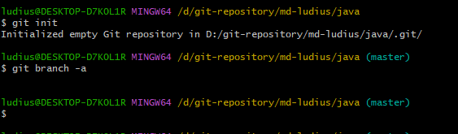
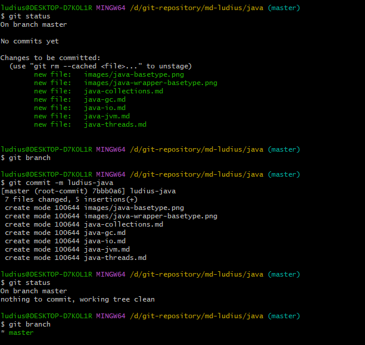

### 本地分支

#### 默认本地分支 master
新创建完成的仓库，没有分支


首次提交后，才会真正创建默认分支master


在未创建master分支前，不能创建其他分支
 

#### HEAD master branch 指针 与 分支
- HEAD：永远自动指向当前commit的指针。

- master：默认分支指针， 新创建的仓库（repository）是没有任何commit的，但在创建第一个commit时会把master指向它, HEAD指向master。

- branch：分支指针， 切换分支后， HEAD指向当前分支


#### 本地分支  操作
```
# 创建新分支，新的分支基于上一次提交建立, 不切换到新建的分支
$ git branch <分支名>

# 列出本地的所有分支，当前所在分支以 "*" 标出
$ git branch

# 列举远程分支
$ git branch -r

# 列举所有分支 包含远程分支
$ git branch -a

# 列出本地的所有分支并显示最后一次提交，当前所在分支以 "*" 标出
$ git branch -v

# 修改分支名称
# 如果不指定原分支名称则为当前所在分支
$ git branch -m [<原分支名称>] <新的分支名称>

# 强制修改分支名称
$ git branch -M [<原分支名称>] <新的分支名称>

# 删除指定的本地分支
$ git branch -d <分支名称>

# 强制删除指定的本地分支
$ git branch -D <分支名称>

```

#### git checkout 分支切换

创建分支和切换分支，撤销变更

```
#### 切换到已存在的指定分支
$ git checkout <分支名称>

#### 创建并切换到指定的分支，保留所有的提交记录
$ git checkout -b <分支名称>

#### 创建并切换到指定的分支，删除所有的提交记录
$ git checkout --orphan <分支名称>

```

#### git switch 切换分支 (Git 2.23)


#### 不同分支之间的差异
```
Git diff branch1 branch2 --stat          //显示出所有有差异的文件列表

Git diff branch1 branch2 文件名(带路径)   //显示指定文件的详细差异

Git diff branch1 branch2                 //显示出所有有差异的文件的详细差异

git diff [local branch] origin/[remote branch] 比较本地分支和远程分支的区别
```

#### 本地分支 合并
merge，rebase，cherry-pick，patch

