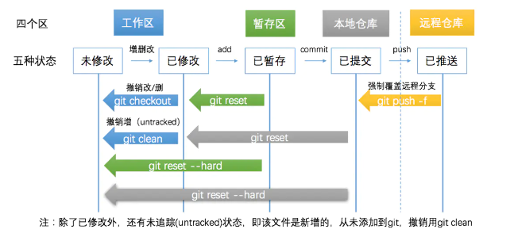

# git 常规命令


### 客户端安装

```
#### ubuntu

sudo apt-get install git
```


### 配置

Git 的 config 文件大致分三类级：仓库级配置文件、用户级配置文件、系统级配置文件

配置文件的权重
<B> 仓库 > 用户 > 系统  </B> 

- 仓库级配置文件：在所创建仓库下 ./.git/config 针对该仓库。 在进入仓库的情况下，
你可以传递 --local 选项让 Git 强制读写此文件，默认情况下用的就是它。

- 用户级配置文件：~/.gitconfig 或 ~/.config/git/config 文件，
你可以传递 --global 选项让 Git 读写此文件，这会对你系统上 所有 的仓库生效。

- 系统级配置文件：在 Git 应用安装目录下 /etc/gitconfig 文件，包含系统上每一个用户及他们仓库的通用配置。
如果在执行 git config 时带上 --system 选项，那么它就会读写该文件中的配置变量。 （由于它是系统配置文件，因此你需要管理员或超级用户权限来修改它。）

```
语法: git config [<options>]        
        
文件位置        
    --global                  #use global config file 使用全局配置文件
    --system                  #use system config file 使用系统配置文件
    --local                   #use repository config file    使用存储库配置文件
    -f, --file <file>         #use given config file    使用给定的配置文件
    --blob <blob-id>          #read config from given blob object    从给定的对象中读取配置
        
动作        
    --get                     #get value: name [value-regex]    获得值：[值]名[正则表达式]
    --get-all                 #get all values: key [value-regex]    获得所有值：[值]名[正则表达式]
    --get-regexp          #get values for regexp: name-regex [value-regex]    得到的值根据正则
    --get-urlmatch            #get value specific for the URL: section[.var] URL    为URL获取特定的值
    --replace-all             #replace all matching variables: name value [value_regex]    替换所有匹配的变量：名称值[ value_regex ]
    --add                     #add a new variable: name value    添加一个新变量：name值
    --unset                   #remove a variable: name [value-regex]    删除一个变量名[值]：正则表达式
    --unset-all               #remove all matches: name [value-regex]    删除所有匹配的正则表达式：名称[值]
    --rename-section          #rename section: old-name new-name    重命名部分：旧名称 新名称
    --remove-section          #remove a section: name    删除部分：名称
    -l, --list                #list all    列出所有
    -e, --edit            #open an editor    打开一个编辑器
    --get-color               #find the color configured: slot [default]    找到配置的颜色：插槽[默认]
    --get-colorbool           #find the color setting: slot [stdout-is-tty]    发现颜色设置：槽[ stdout是TTY ]
        
类型        
    --bool                    #value is "true" or "false"    值是“真”或“假”。
    --int                     #value is decimal number    值是十进制数。
    --bool-or-int             #value is --bool or --int    值--布尔或int
    --path                    #value is a path (file or directory name)    值是路径（文件或目录名）
        
其它        
    -z, --null                #terminate values with NUL byte    终止值与null字节
    --name-only               #show variable names only    只显示变量名
    --includes                #respect include directives on lookup    尊重包括查找指令
    --show-origin             #show origin of config (file, standard input, blob, command line)    显示配置（文件、标准输入、数据块、命令行）的来源
```


#### 配置用户信息
```
$ git config --global user.name "Your Name"

$ git config --global user.email "email@example.com"
```
#### 配置查看 
```
$ git config --list
```

#### 配置配置项
```
# 编辑配置文件
# --local：仓库级，--global：全局级，--system：系统级
$ git config <--local | --global | --system> -e

# 添加配置项
# --local：仓库级，--global：全局级，--system：系统级
$ git config <--local | --global | --system> --add <name> <value>

# 获取配置项
$ git config <--local | --global | --system> --get <name>

# 删除配置项
$ git config <--local | --global | --system> --unset <name>

```

### 工作流程


### 状态


- Untracked: 未跟踪, 此文件在文件夹中, 但并没有加入到git库, 不参与版本控制. 通过git add 状态变为Staged.
- Unmodify: 文件已经入库, 未修改, 即版本库中的文件快照内容与文件夹中完全一致. 这种类型的文件有两种去处, 如果它被修改, 而变为Modified. 如果使用git rm移出版本库, 则成为Untracked文件
- Modified: 文件已修改, 仅仅是修改, 并没有进行其他的操作. 这个文件也有两个去处, 通过git add可进入暂存staged状态, 使用git checkout 则丢弃修改过, 返回到unmodify状态, 这个git checkout即从库中取出文件, 覆盖当前修改
- Staged: 暂存状态. 执行git commit则将修改同步到库中, 这时库中的文件和本地文件又变为一致, 文件为Unmodify状态. 执行git reset HEAD filename取消暂存, 文件状态为Modified

### 创建本地仓库
```
#### 在目录中执行，生成.git文件（Repository 仓库）
git init 

#### 在一个目录下新建本地仓库
git init [project-name] 
```

### 默认本地分支 master
新创建完成的仓库，没有分支


首次提交后，才会真正创建默认分支master


在未创建master分支前，不能创建其他分支


#### HEAD master branch 指针 与 分支
- HEAD：永远自动指向当前commit的指针。

- master：默认分支指针， 新创建的仓库（repository）是没有任何commit的，但在创建第一个commit时会把master指向它, HEAD指向master。

- branch：分支指针， 切换分支后， HEAD指向当前分支


### git status  文件状态


作用：
git status 命令用于显示工作目录和暂存区的状态。

- Changes to be committed
  表示已经从工作区add到暂存区的file（文件或文件夹）, 未commit提交的文件或文件夹

- Changes not staged for commit
  表示工作区，暂时区都存在的file（文件或文件夹），在工作区进行修改或删除，但是没有add到暂存区

- Untracked files
  表示只在工作区有的file（文件或文件夹），也就是在暂时区没有该file。


使用语法:
```
git status [<选项> …​] [--] [<路径名> …​]

提示：方括号 [ ] 表示可选，...表示可以有多项

```

示例:
```

#### 查看所有文件状态
git status


#### 查看指定文件状态
git status [filename]
```

```
#### 精简输出
git status -s
git status --short

第一列字符表示版本库与暂存区之间的比较状态。
第二列字符表示暂存区与工作区之间的比较状态。

' ' （空格）表示文件未发生更改
M 表示文件发生改动。
A 表示新增文件。
D 表示删除文件。
R 表示重命名。
C 表示复制。
U 表示更新但未合并。
? 表示未跟踪文件。
! 表示忽略文件。

```


```
#### 显示未跟踪文件
git status -u[<mode>] 

mode:
  - no 不显示未跟踪的文件。
  - normal 显示未跟踪的文件和目录
  - all 还显示了未跟踪目录下的文件

git status -uno

git status -unormal

git status -uall


normal 和 all 的区别

normal 只会显示已跟踪目录下的文件，未跟踪的目录只会显示目录名，而不会显示未跟踪目录下的文件。

all 则会显示未跟踪目录下的文件。
```

### git add  添加文件到暂存区
```
#### 从工作区添加指定文件到暂存区
git add [file-name1] [file-name2] ... 

#### 将工作区的被修改的文件和新增的文件提交到暂存区，不包括被删除的文件
git add . 

#### u指update，将工作区的被修改的文件和被删除的文件提交到暂存区，不包括新增的文件
git add -u . 

#### A指all，将工作区被修改、被删除、新增的文件都提交到暂存区
git add -A . 

```


### git commit 提交文件到本地仓库

git commit 命令主要是将暂存区里的改动提交到本地的版本库。

```
#### 将暂存区所有文件添加到本地仓库
git commit -m [massage] 

#### 将暂存区指定文件添加到本地仓库
git commit [file-name-1] [file-name-2] -m [massage] 

#### 将工作区的内容直接加入本地仓库
git commit -am [massage] 

#### 追加提交
#### 在不增加一个新的 commit-id 的情况下将新修改的代码追加到前一次的 commit-id 中
#### 对之前的commit 提交进行修改,把新的内容添加到之前的commit里面,这个命令没有添加新的提交，而是用新提交取代了原始提交。
git commit --amend 
```

### git clean 删除所有未跟踪的文件
```
git clean
```

- n ：显示将要被删除的文件
- d ：删除未被添加到 git 路径中的文件（将 .gitignore 文件标记的文件全部删除）
- f ：强制运行
- x ：删除没有被 track 的文件

### git diff 展示差异


#### 命令 
```

## 默认查看的就是 工作区 和 暂存区之间文件的差异

git diff [参数]
```

#### 常用参数
```
## 显示暂存区和版本库之间差异。
git diff –cached	

git diff –staged	

## 显示工作区和版本库之间差异。
git diff HEAD	

## 简单比较结果
git diff –stat	

```


#### 工作区与暂存区的差异
```
# 查看工作区和暂存区之间所有的文件差异
$ git diff

# 查看具体某个文件 在工作区和暂存区之间的差异
$ git diff -- 文件名

# 查看多个文件在工作区和暂存区之间的差异
$ git diff -- 文件名1 文件名2 文件名3

```

#### 工作区与版本库的差异
```
## 查看工作区与最新版本库之间的所有的文件差异
$ git diff HEAD

## 查看工作区与具体某个提交版本之间的所有的文件差异
$ git diff 具体某个版本(提交 哈希值)

## 查看工作区与最新版本库之间的 指定文件名的文件差异
$ git diff HEAD -- 文件名

## 查看工作区与最新版本库之间的 指定文件名的多个文件差异
$ git diff HEAD -- 文件名1 文件名2 文件名3 

## 查看工作区与具体某个版本之间的 指定文件名的文件差异
$ git diff 具体某个版本 -- 文件名 

## 查看工作区与最具体某个版本之间的 指定文件名的多个文件差异
$ git diff 具体某个版本 -- 文件名1 文件名2 文件名3

```

#### 暂存区与版本库的差异
```
## 查看暂存区和 上一次提交 的最新版本(HEAD)之间的所有文件差异
$ git diff --cached

## 查看暂存区和 指定版本 之间的所有文件差异
$ git diff --cached 版本号

## 查看暂存区和 HEAD 之间的指定文件差异
git diff --cached -- 文件名1 文件名2 文件名3

git diff --cached 版本号 -- 文件名1 文件名2 文件名3 ： 查看暂存区和 指定版本 之间的指定文件差异


```
#### 不同版本之间的差异

```
# 查看两个版本之间的差异
$ git diff 版本号1 版本号2

# 查看两个版本之间的指定文件之间的差异
$ git diff 版本号1 版本号2 -- 文件名1 文件名2

#  查看两个版本之间的改动的文件列表
$ git diff 版本号1 版本号2 --stat

#  查看两个版本之间的文件夹 src 的差异
$ git diff 版本号1 版本号2 src

```

#### 不同分支之间的差异
```
Git diff branch1 branch2 --stat          //显示出所有有差异的文件列表

Git diff branch1 branch2 文件名(带路径)   //显示指定文件的详细差异

Git diff branch1 branch2                 //显示出所有有差异的文件的详细差异

git diff [local branch] origin/[remote branch] 比较本地分支和远程分支的区别
```

#### git diff 命令执行后内容解析
```
diff --git a/git-github.md b/git-github.md
// 要对比文件的版本
// a表示修改前的版本， b表示修改后的版本

index 904fd78..c88ab22 100644
// 对比文件的hash值
// 索引区文件hash(904fd78)  工作区文件hash(c88ab22)
// 文件权限(644)

--- a/git-github.md
+++ b/git-github.md
// --- 表示 修改前
// +++ 表示 修改后

@@ -1,3 +1,5 @@
// 标识修改范围
// - 标识修改前  +标识 修改后
// 1,3 表示(开始行，偏移量) ，行号范围[1,3], 即从第一行到第三行
// -1,3 修改前的内容范围，从第一行开始到第三行
// +1,5 修改后的内容范围，从第一行开始到第5行


 # github

-#### 修改1
\ No newline at end of file
+
+
+### 修改222
\ No newline at end of file

// 修改的内容
// - 表示 修改后删除的内容(红色表示)
// + 表示 修改后新增的内容
// 绿色字表示 与修改前有区别的地方
```

### 撤销


#### git checkout
将目标文件从暂存区或本地仓库中的文件检出，覆盖工作区的目标文件
```
$ git checkout [commit-id] -- <file>
```

#### git restore
Git 2.23 版本之后新加的，用来分担之前 git checkout 命令的功能，作用就是用暂存区或者版本库中的文件覆盖本地文件的修改可以达到回退修改的目的，同时也可以使用版本库中的文件覆盖暂存区的文件，达到回退git add 命令的目的,不会影响分支记录的，就是相当于之前的 git checkout 命令重新检出一份文件来覆盖本地的修改。

<B/>不影响提交记录

```
git restore <file>
// 如果已添加到暂存区，执行后，将暂存区版本覆盖工作区版本
// 如果已提交到仓库，执行后，将仓库版本覆盖工作区版本

git restore --staged <file>
// 如果已添加到暂存区，执行后，暂存区版本不覆盖工作区版本，
// 撤销git add 操作，暂存区版本移除，文件状态为已修改未添加到暂存区状态
```

#### git reset

重新设置HEAD指针指向

```
git reset <commit-id> --soft

git reset <commit-id> --mixed

git reset <commit-id> --hard

```



#### git revert


#### git rm