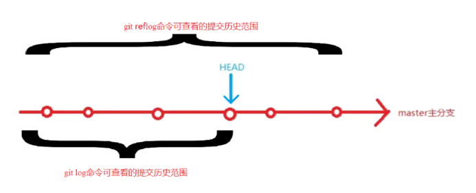

# git 常规命令


### 客户端安装

```
#### ubuntu

sudo apt-get install git
```


### 配置

Git 的 config 文件大致分三类级：仓库级配置文件、用户级配置文件、系统级配置文件

配置文件的权重
<B> 仓库 > 用户 > 系统  </B> 

- 仓库级配置文件：在所创建仓库下 ./.git/config 针对该仓库。 在进入仓库的情况下，
你可以传递 --local 选项让 Git 强制读写此文件，默认情况下用的就是它。

- 用户级配置文件：~/.gitconfig 或 ~/.config/git/config 文件，
你可以传递 --global 选项让 Git 读写此文件，这会对你系统上 所有 的仓库生效。

- 系统级配置文件：在 Git 应用安装目录下 /etc/gitconfig 文件，包含系统上每一个用户及他们仓库的通用配置。
如果在执行 git config 时带上 --system 选项，那么它就会读写该文件中的配置变量。 （由于它是系统配置文件，因此你需要管理员或超级用户权限来修改它。）

```
语法: git config [<options>]        
        
文件位置        
    --global                  #use global config file 使用全局配置文件
    --system                  #use system config file 使用系统配置文件
    --local                   #use repository config file    使用存储库配置文件
    -f, --file <file>         #use given config file    使用给定的配置文件
    --blob <blob-id>          #read config from given blob object    从给定的对象中读取配置
        
动作        
    --get                     #get value: name [value-regex]    获得值：[值]名[正则表达式]
    --get-all                 #get all values: key [value-regex]    获得所有值：[值]名[正则表达式]
    --get-regexp          #get values for regexp: name-regex [value-regex]    得到的值根据正则
    --get-urlmatch            #get value specific for the URL: section[.var] URL    为URL获取特定的值
    --replace-all             #replace all matching variables: name value [value_regex]    替换所有匹配的变量：名称值[ value_regex ]
    --add                     #add a new variable: name value    添加一个新变量：name值
    --unset                   #remove a variable: name [value-regex]    删除一个变量名[值]：正则表达式
    --unset-all               #remove all matches: name [value-regex]    删除所有匹配的正则表达式：名称[值]
    --rename-section          #rename section: old-name new-name    重命名部分：旧名称 新名称
    --remove-section          #remove a section: name    删除部分：名称
    -l, --list                #list all    列出所有
    -e, --edit            #open an editor    打开一个编辑器
    --get-color               #find the color configured: slot [default]    找到配置的颜色：插槽[默认]
    --get-colorbool           #find the color setting: slot [stdout-is-tty]    发现颜色设置：槽[ stdout是TTY ]
        
类型        
    --bool                    #value is "true" or "false"    值是“真”或“假”。
    --int                     #value is decimal number    值是十进制数。
    --bool-or-int             #value is --bool or --int    值--布尔或int
    --path                    #value is a path (file or directory name)    值是路径（文件或目录名）
        
其它        
    -z, --null                #terminate values with NUL byte    终止值与null字节
    --name-only               #show variable names only    只显示变量名
    --includes                #respect include directives on lookup    尊重包括查找指令
    --show-origin             #show origin of config (file, standard input, blob, command line)    显示配置（文件、标准输入、数据块、命令行）的来源
```


#### 配置用户信息
```
$ git config --global user.name "Your Name"

$ git config --global user.email "email@example.com"
```
#### 配置查看 
```
$ git config --list
```

#### 配置配置项
```
# 编辑配置文件
# --local：仓库级，--global：全局级，--system：系统级
$ git config <--local | --global | --system> -e

# 添加配置项
# --local：仓库级，--global：全局级，--system：系统级
$ git config <--local | --global | --system> --add <name> <value>

# 获取配置项
$ git config <--local | --global | --system> --get <name>

# 删除配置项
$ git config <--local | --global | --system> --unset <name>

```

### 工作流程


### 状态


- Untracked: 未跟踪, 此文件在文件夹中, 但并没有加入到git库, 不参与版本控制. 通过git add 状态变为Staged.
- Unmodify: 文件已经入库, 未修改, 即版本库中的文件快照内容与文件夹中完全一致. 这种类型的文件有两种去处, 如果它被修改, 而变为Modified. 如果使用git rm移出版本库, 则成为Untracked文件
- Modified: 文件已修改, 仅仅是修改, 并没有进行其他的操作. 这个文件也有两个去处, 通过git add可进入暂存staged状态, 使用git checkout 则丢弃修改过, 返回到unmodify状态, 这个git checkout即从库中取出文件, 覆盖当前修改
- Staged: 暂存状态. 执行git commit则将修改同步到库中, 这时库中的文件和本地文件又变为一致, 文件为Unmodify状态. 执行git reset HEAD filename取消暂存, 文件状态为Modified

### 创建本地仓库
```
#### 在目录中执行，生成.git文件（Repository 仓库）
git init 

#### 在一个目录下新建本地仓库
git init [project-name] 
```

### 默认本地分支 master
新创建完成的仓库，没有分支


首次提交后，才会真正创建默认分支master


在未创建master分支前，不能创建其他分支


#### HEAD master branch 指针 与 分支
- HEAD：永远自动指向当前commit的指针。

- master：默认分支指针， 新创建的仓库（repository）是没有任何commit的，但在创建第一个commit时会把master指向它, HEAD指向master。

- branch：分支指针， 切换分支后， HEAD指向当前分支


### git status  文件状态


作用：
git status 命令用于显示工作目录和暂存区的状态。

- Changes to be committed
  表示已经从工作区add到暂存区的file（文件或文件夹）, 未commit提交的文件或文件夹

- Changes not staged for commit
  表示工作区，暂时区都存在的file（文件或文件夹），在工作区进行修改或删除，但是没有add到暂存区

- Untracked files
  表示只在工作区有的file（文件或文件夹），也就是在暂时区没有该file。


使用语法:
```
git status [<选项> …​] [--] [<路径名> …​]

提示：方括号 [ ] 表示可选，...表示可以有多项

```

示例:
```

#### 查看所有文件状态
git status


#### 查看指定文件状态
git status [filename]
```

```
#### 精简输出
git status -s
git status --short

第一列字符表示版本库与暂存区之间的比较状态。
第二列字符表示暂存区与工作区之间的比较状态。

' ' （空格）表示文件未发生更改
M 表示文件发生改动。
A 表示新增文件。
D 表示删除文件。
R 表示重命名。
C 表示复制。
U 表示更新但未合并。
? 表示未跟踪文件。
! 表示忽略文件。

```


```
#### 显示未跟踪文件
git status -u[<mode>] 

mode:
  - no 不显示未跟踪的文件。
  - normal 显示未跟踪的文件和目录
  - all 还显示了未跟踪目录下的文件

git status -uno

git status -unormal

git status -uall


normal 和 all 的区别

normal 只会显示已跟踪目录下的文件，未跟踪的目录只会显示目录名，而不会显示未跟踪目录下的文件。

all 则会显示未跟踪目录下的文件。
```

### git add  添加文件到暂存区
```
#### 从工作区添加指定文件到暂存区
git add [file-name1] [file-name2] ... 

#### 将工作区的被修改的文件和新增的文件提交到暂存区，不包括被删除的文件
git add . 

#### u指update，将工作区的被修改的文件和被删除的文件提交到暂存区，不包括新增的文件
git add -u . 

#### A指all，将工作区被修改、被删除、新增的文件都提交到暂存区
git add -A . 

```


### git commit 提交文件到本地仓库

git commit 命令主要是将暂存区里的改动提交到本地的版本库。

```
#### 将暂存区所有文件添加到本地仓库
git commit -m [massage] 

#### 将暂存区指定文件添加到本地仓库
git commit [file-name-1] [file-name-2] -m [massage] 

#### 将工作区的内容直接加入本地仓库
git commit -am [massage] 

#### 追加提交
#### 在不增加一个新的 commit-id 的情况下将新修改的代码追加到前一次的 commit-id 中
git commit --amend 
```

### .gitignore 文件
没有被git纳入管理的文件/文件夹，并且不期望其出现在未追踪文件列表中，可以通过.gitignore 文件，配置可以忽略的文件名称模式，git将根据配置的模式，忽略匹配的文件。

#### glob模式
```
"*"：星号匹配零个或多个任意字符
[]：匹配任何一个列在方括号中的字符，如[ab]匹配a或者匹配b
"?"：问号匹配一个任意字符
[n-m]：匹配所有在这两个字符范围内的字符，如[0-9]表示匹配所有0到9的数字
```
####  格式规范
- 行注释符号 #, 以#符号开头的行 或者 空行， git不解析
- 可以使用标准的 glob 模式匹配
- 匹配模式最后跟斜杠(/)说明要忽略的是目录
- 要忽略指定模式以外的文件或目录，可以在模式前加上感叹号(!)进行取反

#### 示例
```
logs/：忽略当前路径下的logs目录，包含logs下的所有子目录和文件

/logs.txt：忽略根目录下的logs.txt文件

*.class：忽略所有后缀为.class的文件

!/classes/a.class：不忽略classes目录下的a.class文件

tmp/*.txt：只忽略tmp目录下的.txt文件

**/foo：可以忽略/foo, a/foo, a/b/foo等

```
 #### 全局 .gitignore 文件配置
 ```
$ git config --global core.excludesfile ~/.gitignore
 ```
#### .gitignore 文件失效
<B> .gitignore只能忽略没有被track的文件，如果已经被纳入了版本管理中，则修改.gitignore是无效的</B>


### git clean 删除所有未跟踪的文件
```
git clean
```

- n ：显示将要被删除的文件
- d ：删除未被添加到 git 路径中的文件（将 .gitignore 文件标记的文件全部删除）
- f ：强制运行
- x ：删除没有被 track 的文件

### git diff 展示差异


#### 命令 
```

## 默认查看的就是 工作区 和 暂存区之间文件的差异

git diff [参数]
```

#### 常用参数
```
## 显示暂存区和版本库之间差异。
git diff –cached	

git diff –staged	

## 显示工作区和版本库之间差异。
git diff HEAD	

## 简单比较结果
git diff –stat	

```


#### 工作区与暂存区的差异
```
# 查看工作区和暂存区之间所有的文件差异
$ git diff

# 查看具体某个文件 在工作区和暂存区之间的差异
$ git diff -- 文件名

# 查看多个文件在工作区和暂存区之间的差异
$ git diff -- 文件名1 文件名2 文件名3

```

#### 工作区与版本库的差异
```
## 查看工作区与最新版本库之间的所有的文件差异
$ git diff HEAD

## 查看工作区与具体某个提交版本之间的所有的文件差异
$ git diff 具体某个版本(提交 哈希值)

## 查看工作区与最新版本库之间的 指定文件名的文件差异
$ git diff HEAD -- 文件名

## 查看工作区与最新版本库之间的 指定文件名的多个文件差异
$ git diff HEAD -- 文件名1 文件名2 文件名3 

## 查看工作区与具体某个版本之间的 指定文件名的文件差异
$ git diff 具体某个版本 -- 文件名 

## 查看工作区与最具体某个版本之间的 指定文件名的多个文件差异
$ git diff 具体某个版本 -- 文件名1 文件名2 文件名3

```

#### 暂存区与版本库的差异
```
## 查看暂存区和 上一次提交 的最新版本(HEAD)之间的所有文件差异
$ git diff --cached

## 查看暂存区和 指定版本 之间的所有文件差异
$ git diff --cached 版本号

## 查看暂存区和 HEAD 之间的指定文件差异
git diff --cached -- 文件名1 文件名2 文件名3

git diff --cached 版本号 -- 文件名1 文件名2 文件名3 ： 查看暂存区和 指定版本 之间的指定文件差异


```
#### 不同版本之间的差异

```
# 查看两个版本之间的差异
$ git diff 版本号1 版本号2

# 查看两个版本之间的指定文件之间的差异
$ git diff 版本号1 版本号2 -- 文件名1 文件名2

#  查看两个版本之间的改动的文件列表
$ git diff 版本号1 版本号2 --stat

#  查看两个版本之间的文件夹 src 的差异
$ git diff 版本号1 版本号2 src

```


#### 不同分支之间的差异
```
Git diff branch1 branch2 --stat   //显示出所有有差异的文件列表

Git diff branch1 branch2 文件名(带路径)   //显示指定文件的详细差异

Git diff branch1 branch2                   //显示出所有有差异的文件的详细差异

git diff [local branch] origin/[remote branch] 比较本地分支和远程分支的区别
```


### 撤销

#### 撤销工作区文件修改
```
有两种情况：
- 修改后还没有被放到暂存区，现在，撤销修改就回到和版本库一模一样的状态；
- 已经添加到暂存区后，又作了修改，现在，撤销修改就回到添加到暂存区后的状态。
$ git checkout <文件路径>
```

### 查看日志



#### git log 查看提交历史

使用git log命令只可以查看到HEAD指针及其之前的版本信息,git log命令是显示当前的HEAD和它的祖先。

```
git log
```


#### 显示 ASCII 图形表示的分支合并历史。

```
git log --graph	
```
##### 符号解释
```
* ：表示一次提交
| ：表示分支提交路径
/ ：新建分支
\ : 分支合并
```


#### git reflog 查看引用日志

查看到所有历史版本信息。
```


```


### 本地分支

#### 本地分支  操作
```
# 创建新分支，新的分支基于上一次提交建立, 不切换到新建的分支
$ git branch <分支名>

# 列出本地的所有分支，当前所在分支以 "*" 标出
$ git branch

# 列举远程分支
$ git branch -r

# 列举所有分支 包含远程分支
$ git branch -a

# 列出本地的所有分支并显示最后一次提交，当前所在分支以 "*" 标出
$ git branch -v

# 修改分支名称
# 如果不指定原分支名称则为当前所在分支
$ git branch -m [<原分支名称>] <新的分支名称>

# 强制修改分支名称
$ git branch -M [<原分支名称>] <新的分支名称>

# 删除指定的本地分支
$ git branch -d <分支名称>

# 强制删除指定的本地分支
$ git branch -D <分支名称>

```

#### git checkout 分支切换

创建分支和切换分支，撤销变更

```
#### 切换到已存在的指定分支
$ git checkout <分支名称>

#### 创建并切换到指定的分支，保留所有的提交记录
$ git checkout -b <分支名称>

#### 创建并切换到指定的分支，删除所有的提交记录
$ git checkout --orphan <分支名称>

```

#### 本地分支 合并
merge，rebase，cherry-pick，patch
