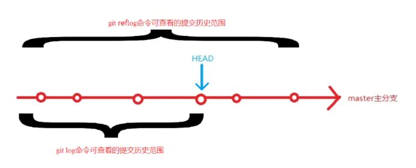
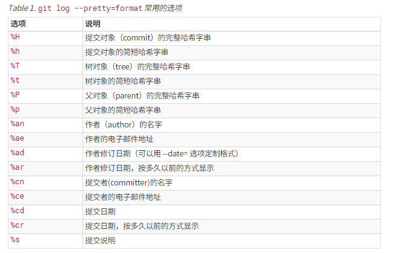

### 查看日志



#### git log 查看提交历史

使用git log命令只可以查看到HEAD指针及其之前的版本信息,git log命令是显示当前的HEAD和它的祖先。

```
git log
```
##### 常用选项
|选项 |	  说明   |
| ------ | ------ |
|-p|按补丁格式显示每个更新之间的差异|
|--name-only|仅在提交信息后显示已修改的文件清单|
|--name-status|显示新增、修改、删除的文件清单|
|--grap|显示 ASCII 图形表示的分支合并历史|
|--pretty|格式化历史提交信息|


#### 格式化显示提交信息 --pretty

<B/>  git log --pretty=fuller
```
// hashid commit-id
commit d1d010b00863a9a17734dc7e370c1483632bc0e1 (HEAD -> master)
// 作者
Author:     “ludius” <“ludius.song001@foxmail.com”>
// 作者修订日期
AuthorDate: Thu Jan 12 11:37:22 2023 +0800
// 提交人
Commit:     “ludius” <“ludius.song001@foxmail.com”>
// 提交日期
CommitDate: Thu Jan 12 11:37:22 2023 +0800

    test git reset
```

<B/>  git log --pretty=full
```
commit d1d010b00863a9a17734dc7e370c1483632bc0e1 (HEAD -> master)
Author: “ludius” <“ludius.song001@foxmail.com”>
Commit: “ludius” <“ludius.song001@foxmail.com”>

    test git reset

```

<B/>  git log --pretty=short
```
Author: “ludius” <“ludius.song001@foxmail.com”>

    test git reset
```

<B/>  git log --pretty=oneline
```
d1d010b00863a9a17734dc7e370c1483632bc0e1 (HEAD -> master) test git reset
```

<B/>  git log --pretty=format
```
git log --pretty=format:"%h %s"
```

format 常用选项


#### 显示 ASCII 图形表示的分支合并历史。

```
git log --graph	
```
##### 符号解释
```
* ：表示一次提交
| ：表示分支提交路径
/ ：新建分支
\ : 分支合并
```


#### git reflog 查看引用日志

查看到所有历史版本信息。
```


```