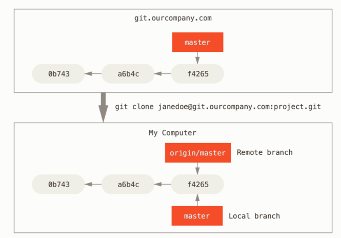
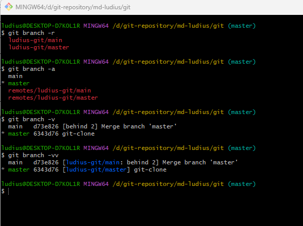
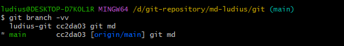
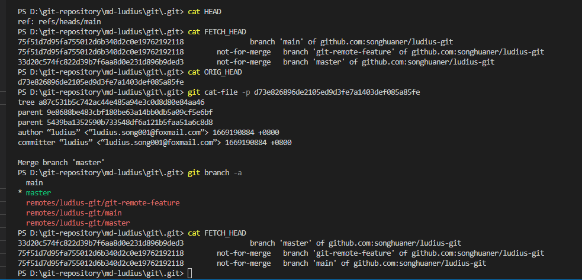

# git 远程仓库


### 创建远程公共仓库
```
#### 裸仓库 作为公共仓库 没有工作区
git init --bare  [repo.git]
```


### 远程仓库操作
```
# 列出已经存在的远程仓库
$ git remote

# 列出远程仓库的详细信息，在别名后面列出URL地址
$ git remote -v
$ git remote --verbose

# 添加远程仓库  将本地仓库与远程仓库绑定
$ git remote add <远程仓库的别名> <远程仓库的URL地址>

# 修改远程仓库的别名
$ git remote rename <原远程仓库的别名> <新的别名>

# 删除指定名称的远程仓库
$ git remote remove <远程仓库的别名>


```
#### 远程仓库地址修改

```
# 修改远程仓库的 URL 地址
$ git remote set-url <远程仓库的别名> <新的远程仓库URL地址>

# 为已存在的远程仓库，添加仓库链接
# 可以同时同步多个仓库
$ git remote set-url --add <远程仓库的别名> <新的远程仓库URL地址>

# 修改push时，远程仓库的地址
$ git remote set-url --push <远程仓库的别名> <远程仓库URL地址>

```

执行 git remote -v 
远程仓库的地址分为fetch(拉取)和push(推送)
通过 "git remote set-url --push" 可以修改 push地址，可以实现从一个仓库拉取,推送给另一个仓库

```
PS D:\git-repository\md-ludius\git> git remote -v
ludius-git      git@github.com:songhuaner/ludius-git.git (fetch)
ludius-git      git@github.com:songhuaner/ludius-git.git (push)

```


### 克隆远程仓库
```
#### 克隆一个远程仓库
git clone <远程仓库的网址> 

# 指定本地仓库的目录
$ git clone <远程仓库的网址> <本地目录>

# -b 指定要克隆的分支，默认是master分支
$ git clone <远程仓库的网址> -b <分支名称> <本地目录>

# -o 自定义远程仓库名称
 git clone -o <自定义远程仓库名称>

```


Git 的 clone 命令会自动将远程仓库命名为 origin，拉取它的所有数据， 创建一个指向它的 master 分支的指针，并且在本地将其命名为 origin/master。 

Git 也会给你一个与 origin 的 master 分支在指向同一个地方的本地 master 分支。

<B>
“master” 是当你运行 git init 时默认的起始分支名字，原因仅仅是它的广泛使用。
“origin” 是当你运行 git clone 时默认的远程仓库名字。 
远程仓库名字 “origin” 与分支名字 “master”，在 Git 中并没有任何特别的含义。
如果你运行 git clone -o booyah，那么你默认的远程分支名字将会是 booyah/master。
</B>


### 远程分支
远程分支，即为远程仓库中的普通分支



#### 远程追踪分支/跟踪分支
以<远程仓库名>/<远程分支名>的形式命名，如 ludius-git/master。


#### 上游分支


.git/config 配置
```
[remote "ludius-git"]
        url = git@github.com:songhuaner/ludius-git.git
        fetch = +refs/heads/*:refs/remotes/ludius-git/*
[branch "master"]
        remote = ludius-git
        merge = refs/heads/main
```
#### 查看跟踪分支信息
本地分支与远程分支的联系

```
$ git branch -vv
```


#### 创建远程分支与本地分支的联系

##### 存在本地分支， 存在远程分支
```
$ git branch --set-upstream-to=<远程分支> <本地分支>

$ git branch -u <远程分支> <本地分支>
```

##### 存在远程分支，本地分支不存在
```
# 创建本地分支，并且追踪远程分支
git branch --track <本地分支> <远程分支>

# 创建本地分支， 切换新建的本地分支为当前分支， 当前分支追踪远程分支
git checkout -b <本地分支> <远程分支>

# 创建与远程分支同名的本地分支，切换新建的同名本地分支未当前分支，当前分支追踪远程分支
git checkout --track <远程分支>

git checkout -t <远程分支>
```
##### 存在本地分支， 远程分支不存在

###### 将本地分支推送到远程仓库， 当远程分支不存在时，新建与本地分支同名的远程分支
###### 此时远程分支与本地分支之间没有联系
```
# 提交到远程分支
$ git push <远程仓库名> <本地分支名>
# 关联本地分支与远程分支
$ git branch --set-upstream-to=<远程分支> <本地分支>

```

###### 合并上述操作
``` 
$ git push -u <远程仓库名> <本地分支名>
```

#### 删除远程分支
```
$ git branch -d -r <分支名称>
```

#### 推送远程分支 git push 

##### 将本地分支的更新，推送到远程分支 
##### 如果远程分支不存在，则会新建
```
$ git push <远程仓库名> <本地分支名>:<远程分支名>
```

##### 省略远程分支名
##### 如果远程分支存在，则表示将本地分支推送与之存在”追踪关系”的远程分支(通常两者同名)
##### 如果远程分支不存在，则会被新建。此时，新建的远程分支未与本地分支建立关联
```
$ git push <远程仓库名> <本地分支名>

# 关联远程分支和本地分支
$ git branch --set-upstream-to=<远程分支> <本地分支>
```


##### 省略 本地分支
##### 表示删除指定的远程分支，等同于推送一个空的本地分支到远程分支

```
$ git push <远程仓库名> :<远程分支名>

$ git push origin :master

$ git push origin --delete master

```


##### 省略 本地分支与远程分支
##### 如果当前分支与远程分支之间存在追踪关系，则本地分支和远程分支都可以省略。
```
$ git push origin
```


##### 省略 远程仓
##### 根据配置项push.default 定义的动作执行
```
$ git push
```
###### 配置项push.default

 如果git push命令没有指定推送的源分支和目标分支，那么git会采用push.default定义的动作。不同的值适用于不同的工作流程模式。

```
nothing: 直接push会出错，需要显式的指出推送的远程分支，例如:git push origin master；

current: 推送时只会推送当前所在的分支到远程同名分支，如果远程分支不存在相应的同名分支，则创建该分支；

upstream: 推送当前分支到它的upstream分支上，这个模式只适用于推送到与拉取数据相同的仓库;

simple: 在中央仓库工作流程模式下，只能推送到与本地分支名一致的upstream分支中，
如果推送的远程仓库和拉取数据的远程仓库不一致，那么该模式会像current模式一样进行操作。
因为该选项对于新手来说是最安全的，所以在git 2.0中，simple是push.default的默认值配置项(2.0以前的默认配置项是matching)；

matching: 推送本地和远程都存在的同名分支
```


##### 在多个远程分支中，选择需要推送的远程分支
```
$ git push -u origin master
```

##### 强制推送
将本地历史覆盖到远端仓库
```
$ giit push --force
$ giit push --f
```

#### 提取远程分支 git fetch  

##### FETCH_HEAD


<B>FETCH_HEAD 指的是某个分支在远程仓库上最新的状态。</B>
每一个执行过 git fetch 操作的本地仓库都会存在一个 FETCH_HEAD 列表，这个列表保存在 .git/FETCH_HEAD 文件中。
FETCH_HEAD 文件中的每一行对应着远程仓库的一个分支。
当前本地分支指向的 FETCH_HEAD 就是该文件中的「第一行」对应的分支。


##### 拉取「所有远程仓库」所包含的分支到本地，并在本地创建或更新远程分支。
##### 所有分支最新的 Commit-ID 都会记录在 .git/FETCH_HEAD 文件中，若有多个分支，FETCH_HEAD 内会多行数据.

```
$ git fetch 
```
##### 拉取远程仓库的所包含的分支到本地，FETCH_HEAD 设定同上。
```
$ git fetch <远程仓库>
```

##### 拉取远程仓库中指定的远程分支到本地，且 FETCH_HEAD文件中，只记录远程仓库中指定的远程分支最新的 Commit-ID。
```
$ git fetch <远程仓库> <远程分支>
```

##### 拉取远程仓库中指定远程分支到本地，
##### FETCH_HEAD 记录了远程仓库指定的远程分支最新的 Commit-ID
##### 基于远程仓库的远程分支创建一个本地分支
```
git fetch <远程仓库> <远程分支>:<本地分支>
```

#### 拉取远程分支 git pull (git fetch + git merge FETCH_HEAD)


##### 拉取远程分支 <远程主机名>/<远程分支名> 内容到本地，并与 <本地分支名> 合并
```
git pull <远程主机名> <远程分支名>:<本地分支名>
```


##### 拉取远程分支 <远程主机名>/<远程分支名> 内容到本地，并与 当前本地分支(HEAD) 合并
```
git pull <远程主机名> <远程分支名>
```

##### 自动拉取当前本地分支对应的上游远程分支，并合并
```
git pull <远程主机名>
```

