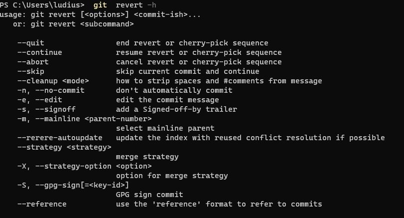
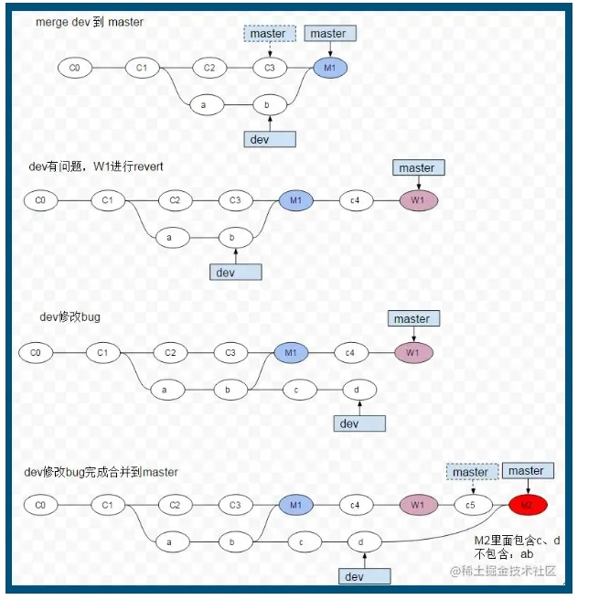
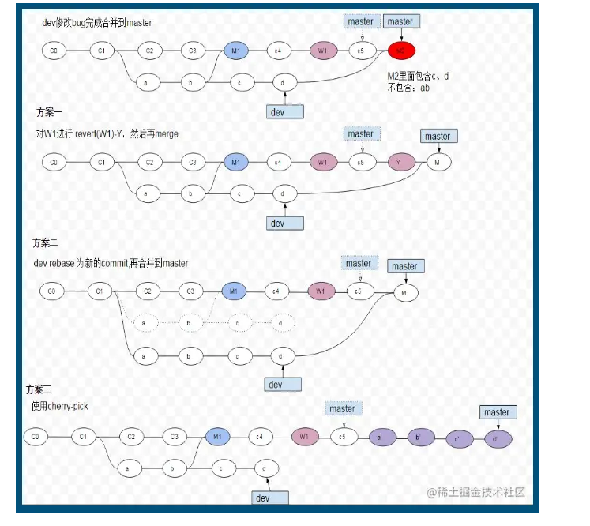

# 撤销

### 撤销


#### git checkout 检出
将目标文件从暂存区或本地仓库中的文件检出，覆盖工作区的目标文件
各分支共享暂存区和工作区，在commit改动之前，每个分支看到的文件情况相同，如果执行stash指令，在其他分支中指保留新建文件操作。
```
$ git checkout [commit-id] -- <file>
```

#### git restore 另存
Git 2.23 版本之后新加的，用来分担之前 git checkout 命令的功能
作用就是用暂存区或者版本库中的文件覆盖本地文件的修改可以达到回退修改的目的，
同时也可以使用版本库中的文件覆盖暂存区的文件，达到回退git add 命令的目的,
不会影响分支记录的，就是相当于之前的 git checkout 命令重新检出一份文件来覆盖本地的修改。

<B/>不影响提交记录

```
git restore <file>
// 如果已添加到暂存区，执行后，将暂存区版本覆盖工作区版本
// 如果已提交到仓库，执行后，将仓库版本覆盖工作区版本

git restore --staged <file>
// 如果已添加到暂存区，执行后，暂存区版本不覆盖工作区版本，
// 撤销git add 操作，暂存区版本移除，文件状态为已修改未添加到暂存区状态
```

#### git reset 重置

将当前的分支重设(reset)到指定的 commit-id 或者 HEAD，并且根据 [mode] 更新索引或工作目录

mode :
- hard  
  工作区、暂存区、本地仓库都会回滚到对应commit-id
- soft
  工作区和暂存区的代码不会受到影响，但是本地仓库的代码会回滚到对应的commit-id上
- mixed (默认) 
  工作区代码不会受到影响，但是暂存区、本地仓库区的代码已经回滚到对应的commit-id上

```
git reset [--hard|soft|mixed] [<commit>或HEAD] [file]
```


```
git reset <commit-id> --soft
```


```
git reset <commit-id> --mixed
```


```
git reset <commit-id> --hard
```


#### git revert 反转
git revert是提交一个新的版本，将需要revert的版本的内容再反向修改回去，版本会递增，不影响之前提交的内容



##### 基础命令
```
git revert --abort // 放弃 回到原始状态
git revert --quit // 退出 保留变化
git revert --continue //冲突解决后 继续
``` 
##### 一般流程
```
// 反做
git revert -n 版本号 //不自动提交新版本

如有冲突，处理冲突

// 提交
git add .
git commit -m "....."

```

##### 回退多个版本
```
git revert X...Y
用法： X...Y 代表一个左开右闭区间(X,Y],不包括X,包括Y. 其中Y为起点commit，X为终点commit的下一个commit
```

##### 回退 merge commit
 commit 分为两种：
 一种是常规的 commit，也就是使用 git commit 提交的 commit；
另一种是 merge commit，在使用 git merge 合并两个分支之后，你将会得到一个新的 merge commit

如果直接使用 git revert <commit id>，git 也不知道到底要撤除哪一条分支上的内容，这时需要指定一个 parent number 标识出"主线"，主线的内容将会保留，而另一条分支的内容将被 revert。

```
git show 版本号 //查看详情 确认主线
git revert -m "主线编号" 版本号


// 举例
git show bd86846
commit bd868465569400a6b9408050643e5949e8f2b8f5
Merge: ba25a9d 1c7036f

git revert -m 1 bd86846 // 反做 ba25a9d

```

##### 特别注意



1.merge dev到master
2.过了若干时间后，在C4时突然发现当初合并进master的dev的M1代码有问题，此时对master上的M1进行revert(反造)，形成一个新的提交W1在master上，此时M1提交的代码已经被W1所反造了，相当于把M1的代码进行了回滚
3.好了，既然是dev的问题，切换回dev进行若干个版本（c,d）的开发后，把之前的bug修复
4.dev修复完bug后，重新把dev的代码merge进master,但是，此时问题来了，M2的合并完成后的代码是不包含dev分支上的a,b两个提交的代码，为什么呢？因为当git merge某个分支的代码时，只会合并分支没有合并过的提交，如图，git判断到a,b两个提交的代码已经在M1合并过了，所以在M2进行合并时，只会把c,d的两个提交的变更合并的到master上，但是我们在W1时，又把之前M1提交的a,b两个提交进行了反造，所以在M2将dev merge进master时，会丢失，a,b这两个提交。




方案一： 在dev修复完bug后，执行git merge dev之前，先对W1的revert(反造)再进行一次revert(反造),相当于把在W1删除的M1的变更又添加了回来，这时再执行git merge dev就不会丢失a,b两次提交的变更了
方案二： 在dev修复完bug后，先将dev以master进行rebase(变基)，因为rebase后，a,b两次的提交的commitID，已经和M1时merge进master的commitID不一样了，此时再执行git merge dev，git判断到dev上a,b,c,d的commitID均没有在master上出现过，就会把dev上所有的代码都合并到master
方案三： 在dev修复完bug后，使用cherry-pick 手动把，dev上的a,b,c,d的代码都合并到master上，形成4个新的commit,这样也不会丢失a,b的变更。
