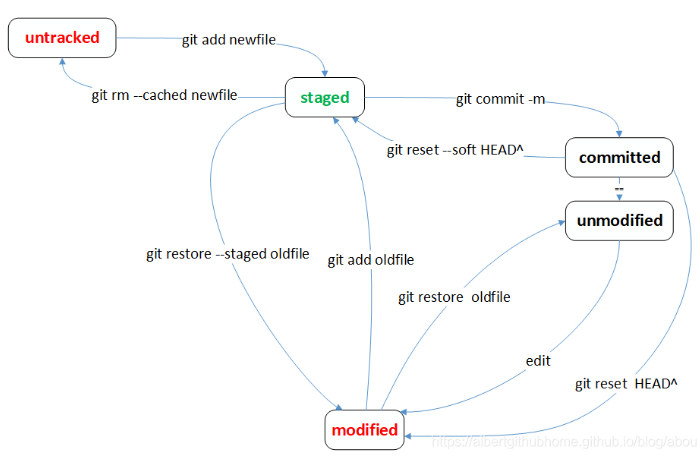

# 撤销

### 撤销





#### git checkout 检出
将目标文件从暂存区或本地仓库中的文件检出，覆盖工作区的目标文件

```
$ git checkout [commit-id] -- <file>
```

#### git restore 另存
Git 2.23 版本之后新加的，用来分担之前 git checkout 命令的功能
作用就是用暂存区或者版本库中的文件覆盖本地文件的修改可以达到回退修改的目的，
同时也可以使用版本库中的文件覆盖暂存区的文件，达到回退git add 命令的目的,
不会影响分支记录的，就是相当于之前的 git checkout 命令重新检出一份文件来覆盖本地的修改。

<B/>不影响提交记录

```
git restore <file>
// 如果已添加到暂存区，执行后，将暂存区版本覆盖工作区版本
// 如果已提交到仓库，执行后，将仓库版本覆盖工作区版本

git restore --staged <file>
// 如果已添加到暂存区，执行后，暂存区版本不覆盖工作区版本，
// 撤销git add 操作，暂存区版本移除，文件状态为已修改未添加到暂存区状态
```

#### git reset 重置

将当前的分支重设(reset)到指定的 commit-id 或者 HEAD，并且根据 [mode] 更新索引或工作目录

mode :
- hard  
  工作区、暂存区、本地仓库都会回滚到对应commit-id
- soft
  工作区和暂存区的代码不会受到影响，但是本地仓库的代码会回滚到对应的commit-id上
- mixed (默认) 
  工作区代码不会受到影响，但是暂存区、本地仓库区的代码已经回滚到对应的commit-id上

```
git reset [--hard|soft|mixed] [<commit>或HEAD] [file]
```


```
git reset <commit-id> --soft
```


```
git reset <commit-id> --mixed
```


```
git reset <commit-id> --hard
```


#### git revert 反转
git revert是提交一个新的版本，将需要revert的版本的内容再反向修改回去，版本会递增，不影响之前提交的内容


git revert --quit

git revert --abort

git revert 


#### git rm  删除文件

同时删除暂存区、工作区的文件，并且将这次删除放入暂存区
```
git rm <file>

// 删除目录

git rm -r <directory>
```

删除暂存区文件，但保留工作区的文件，并且将这次删除放入暂存区
```
 git rm --cached <file>
```