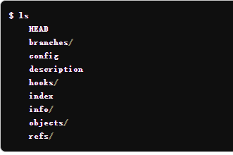
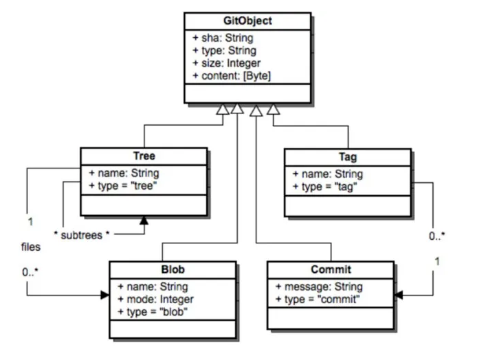
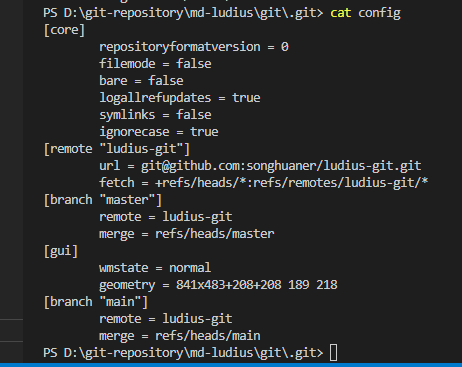

# git 原理

### 仓库文件夹

执行 git init 时，Git 会创建一个 .git 目录。包含以下目录


重要的文件或目录：

- objects 目录存储所有数据内容
- refs 目录存储指向数据 (分支) 的提交对象的指针
- HEAD 文件指向当前分支
- index 文件保存了暂存区域信息
- config 配置文件


### git 哈希
```
$ git hash-object

```
作用:
<b>使用指定文件的内容（可以在工作树之外）计算具有指定类型的对象的对象ID值，并可选择将结果对象写入对象数据库。将其对象ID报告给其标准输出</b>

### 索引 index


### git 对象




git一共有4种对象，commit(提交对象)、tree(树对象)、blob(数据对象)、tag(标签对象)

git中所有对象都存储在 <b>.git/objects</b> 目录下


- commit：记录了对应tree对象的hash键值值、上一次commit对应的hash键值、版本作者、版本序列、版本说明和提交时间等附加信息

- tree：记录了对应版本文件名、文件目录结构

- blob：对文件内容的记录


### git 引用

<b>存储位置: .git/refs</b>


#### 4类引用
##### 指向最后一次提交的reference (分支名)
以“refs/heads/”为前缀，例如“refs/heads/master”，实际就是git分支，git分支指向某一个commit。正因为此，各种分支名的全称应该是（省略refs字段）：
```
heads/master 
heads/bX 
heads/bY
```
不过由于Git默认分支类reference的前缀是“refs/heads/”，因此平时操作分支的时候，可以把“heads”省去。

##### 指向当前分支的reference（HEAD 标记）
这个reference比较特别，它没有指向某一个SHA-1字符串，而是指向当前正在工作的分支名，如指向refs/heads/master

因此，HEAD标记就是当前分支的标记，具体可以参考2.1小节的介绍。

##### 指向某一个tag的reference
这类reference以“refs/tags/”为前缀，指向git仓库某一个tag。

有关git tag的知识，后面用到的时候再介绍。

##### 指向远端仓库最后一次提交的reference（远端分支）
这类reference以“refs/remotes/”为前缀，指向远端仓库某个SHA-1字符串的标记（也即远端分支），其格式为：

refs/remotes/远端仓库名（如origin）/远端分支reference名（如master）

因此，平时我们操作远端分支的时候，所操作的分支名为（以远端master分支为例）：

remotes/origin/master

其实就是省略掉refs字段的reference名称。

总结：知道了这4类reference的含义，以及命名方式之后，我们对各类git名称，会有更深刻的理解。

### refspec
一种格式，git通过这种格式来表示本地分支与远程分支的映射关系
```
[+]＜src＞:＜dst＞

[+] : 可选  即使不能快速演进的情况下，也去强制更新它q
<src> ： 参数表示本地仓库的源分支
<dst> ： 参数则表示处于远程仓库中的目标分支
```



```
[remote "ludius-git"]
        url = git@github.com:songhuaner/ludius-git.git
        fetch = +refs/heads/*:refs/remotes/ludius-git/*
```

查看本地分支与远程分支映射关系
```
#### 通过git branch -vv 查看本地与远程分支的关联情况
```


### git branch 命令原理

### git add 命令原理

### git commit 命令原理

